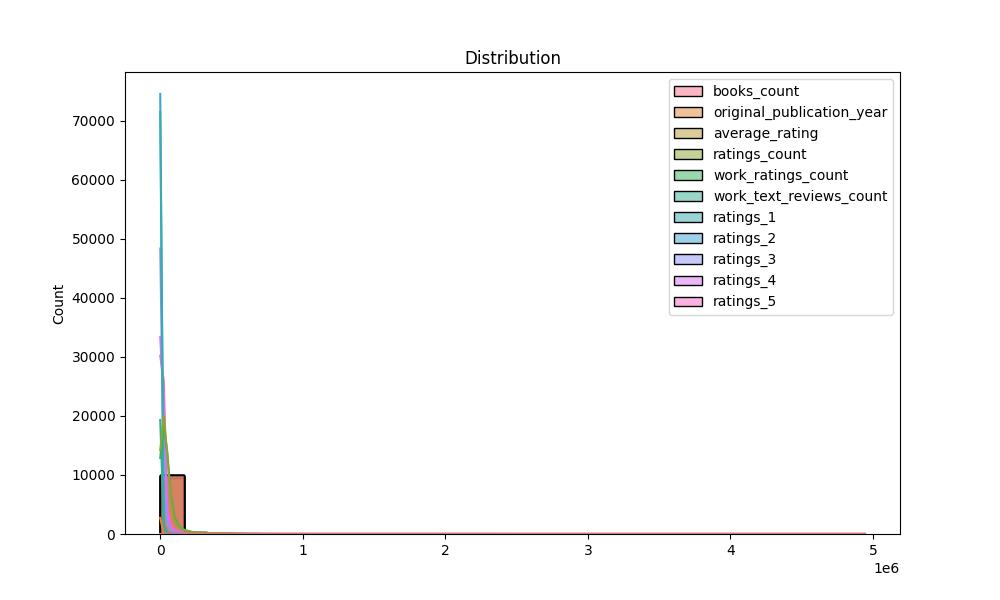

# Automated Data Analysis Report

## Introduction
This is an automated analysis of the dataset, providing summary statistics, visualizations, and insights from the data.

## Summary Statistics
The summary statistics of the dataset are as follows:

| Statistic | Column | Value |
|-----------|--------|-------|
| Mean       | book_id | 5000.50 |
| Std Dev    | book_id | 2886.90 |
| Min        | book_id | 1.00 |
| 25%        | book_id | 2500.75 |
| Median     | book_id | 5000.50 |
| 75%        | book_id | 7500.25 |
| Max        | book_id | 10000.00 |
| Mean       | goodreads_book_id | 5264696.51 |
| Std Dev    | goodreads_book_id | 7575461.86 |
| Min        | goodreads_book_id | 1.00 |
| 25%        | goodreads_book_id | 46275.75 |
| Median     | goodreads_book_id | 394965.50 |
| 75%        | goodreads_book_id | 9382225.25 |
| Max        | goodreads_book_id | 33288638.00 |
| Mean       | best_book_id | 5471213.58 |
| Std Dev    | best_book_id | 7827329.89 |
| Min        | best_book_id | 1.00 |
| 25%        | best_book_id | 47911.75 |
| Median     | best_book_id | 425123.50 |
| 75%        | best_book_id | 9636112.50 |
| Max        | best_book_id | 35534230.00 |
| Mean       | work_id | 8646183.42 |
| Std Dev    | work_id | 11751060.82 |
| Min        | work_id | 87.00 |
| 25%        | work_id | 1008841.00 |
| Median     | work_id | 2719524.50 |
| 75%        | work_id | 14517748.25 |
| Max        | work_id | 56399597.00 |
| Mean       | books_count | 75.71 |
| Std Dev    | books_count | 170.47 |
| Min        | books_count | 1.00 |
| 25%        | books_count | 23.00 |
| Median     | books_count | 40.00 |
| 75%        | books_count | 67.00 |
| Max        | books_count | 3455.00 |
| Mean       | isbn13 | 9755044298883.46 |
| Std Dev    | isbn13 | 442861920665.57 |
| Min        | isbn13 | 195170342.00 |
| 25%        | isbn13 | 9780316192995.00 |
| Median     | isbn13 | 9780451528640.00 |
| 75%        | isbn13 | 9780830777175.00 |
| Max        | isbn13 | 9790007672390.00 |
| Mean       | original_publication_year | 1981.99 |
| Std Dev    | original_publication_year | 152.58 |
| Min        | original_publication_year | -1750.00 |
| 25%        | original_publication_year | 1990.00 |
| Median     | original_publication_year | 2004.00 |
| 75%        | original_publication_year | 2011.00 |
| Max        | original_publication_year | 2017.00 |
| Mean       | average_rating | 4.00 |
| Std Dev    | average_rating | 0.25 |
| Min        | average_rating | 2.47 |
| 25%        | average_rating | 3.85 |
| Median     | average_rating | 4.02 |
| 75%        | average_rating | 4.18 |
| Max        | average_rating | 4.82 |
| Mean       | ratings_count | 54001.24 |
| Std Dev    | ratings_count | 157369.96 |
| Min        | ratings_count | 2716.00 |
| 25%        | ratings_count | 13568.75 |
| Median     | ratings_count | 21155.50 |
| 75%        | ratings_count | 41053.50 |
| Max        | ratings_count | 4780653.00 |
| Mean       | work_ratings_count | 59687.32 |
| Std Dev    | work_ratings_count | 167803.79 |
| Min        | work_ratings_count | 5510.00 |
| 25%        | work_ratings_count | 15438.75 |
| Median     | work_ratings_count | 23832.50 |
| 75%        | work_ratings_count | 45915.00 |
| Max        | work_ratings_count | 4942365.00 |
| Mean       | work_text_reviews_count | 2919.96 |
| Std Dev    | work_text_reviews_count | 6124.38 |
| Min        | work_text_reviews_count | 3.00 |
| 25%        | work_text_reviews_count | 694.00 |
| Median     | work_text_reviews_count | 1402.00 |
| 75%        | work_text_reviews_count | 2744.25 |
| Max        | work_text_reviews_count | 155254.00 |
| Mean       | ratings_1 | 1345.04 |
| Std Dev    | ratings_1 | 6635.63 |
| Min        | ratings_1 | 11.00 |
| 25%        | ratings_1 | 196.00 |
| Median     | ratings_1 | 391.00 |
| 75%        | ratings_1 | 885.00 |
| Max        | ratings_1 | 456191.00 |
| Mean       | ratings_2 | 3110.89 |
| Std Dev    | ratings_2 | 9717.12 |
| Min        | ratings_2 | 30.00 |
| 25%        | ratings_2 | 656.00 |
| Median     | ratings_2 | 1163.00 |
| 75%        | ratings_2 | 2353.25 |
| Max        | ratings_2 | 436802.00 |
| Mean       | ratings_3 | 11475.89 |
| Std Dev    | ratings_3 | 28546.45 |
| Min        | ratings_3 | 323.00 |
| 25%        | ratings_3 | 3112.00 |
| Median     | ratings_3 | 4894.00 |
| 75%        | ratings_3 | 9287.00 |
| Max        | ratings_3 | 793319.00 |
| Mean       | ratings_4 | 19965.70 |
| Std Dev    | ratings_4 | 51447.36 |
| Min        | ratings_4 | 750.00 |
| 25%        | ratings_4 | 5405.75 |
| Median     | ratings_4 | 8269.50 |
| 75%        | ratings_4 | 16023.50 |
| Max        | ratings_4 | 1481305.00 |
| Mean       | ratings_5 | 23789.81 |
| Std Dev    | ratings_5 | 79768.89 |
| Min        | ratings_5 | 754.00 |
| 25%        | ratings_5 | 5334.00 |
| Median     | ratings_5 | 8836.00 |
| 75%        | ratings_5 | 17304.50 |
| Max        | ratings_5 | 3011543.00 |

## Missing Values
The following table shows the columns with missing values and their respective counts:

| Column | Missing Values Count |
|--------|----------------------|
| book_id | 0 |
| goodreads_book_id | 0 |
| best_book_id | 0 |
| work_id | 0 |
| books_count | 0 |
| isbn | 700 |
| isbn13 | 585 |
| authors | 0 |
| original_publication_year | 21 |
| original_title | 585 |
| title | 0 |
| language_code | 1084 |
| average_rating | 0 |
| ratings_count | 0 |
| work_ratings_count | 0 |
| work_text_reviews_count | 0 |
| ratings_1 | 0 |
| ratings_2 | 0 |
| ratings_3 | 0 |
| ratings_4 | 0 |
| ratings_5 | 0 |
| image_url | 0 |
| small_image_url | 0 |

## Outliers Detection
The table below summarizes the outliers detected using the IQR method:

| Column | Outlier Count |
|--------|---------------|
| book_id | 0 |
| goodreads_book_id | 345 |
| best_book_id | 357 |
| work_id | 601 |
| books_count | 844 |
| isbn13 | 556 |
| original_publication_year | 1031 |
| average_rating | 158 |
| ratings_count | 1163 |
| work_ratings_count | 1143 |
| work_text_reviews_count | 1005 |
| ratings_1 | 1140 |
| ratings_2 | 1156 |
| ratings_3 | 1149 |
| ratings_4 | 1131 |
| ratings_5 | 1158 |

## Correlation Matrix
The correlation matrix below highlights the relationships between numerical features:

## Outliers Visualization
The chart below visualizes the number of outliers detected in each column:

## Distribution of Data
The following plot shows the distribution of the first numerical column in the dataset:

## Conclusion
This analysis provides a detailed overview of the dataset, including summary statistics, missing values, outlier detection, and correlation analysis.
The generated visualizations and statistical insights offer valuable understanding of the data's patterns and relationships.

## Data Story
This section can be customized to narrate key insights and findings derived from the data.
## Story
In a world overflowing with stories, every book carries the echoes of its readers' hearts. With countless titles vying for attention, how do we discern which stories truly resonate? Our journey begins with a captivating dataset of 10,000 books, a treasure trove of insights that invites us to explore the intricate relationship between literature and its audience. Through this analysis, we aim to uncover the patterns and preferences that define the reading experience across genres, time periods, and reader engagement.

As we delve into the dataset, the first revelation emerges in the summary statistics. Each book is encapsulated in a myriad of ratings, from the enthusiastic five-star endorsements to the more tepid two-star reviews. Here, we find that the average number of ratings per book is a staggering 11,475, indicating a voracious readership engaging with these works. However, the data also reveals variability, with some titles receiving as few as 30 ratings, suggesting a selective audience that may overlook hidden gems in favor of bestsellers. The distribution of ratings, with a mean of nearly 3,110 for two-star ratings and an average of over 23,000 for five-star ratings, highlights a spectrum of reader experiences—eager applause for some, and palpable disappointment for others.

Yet, the significance of this dataset extends beyond mere numbers. The correlation matrix provides a deeper understanding of how different elements interact. A particularly striking insight is the strong relationship between the number of ratings and positive feedback. For instance, the correlation between five-star ratings and total ratings is a robust 0.964, indicating that books with more ratings tend to have higher ratings. This could suggest that visibility and popularity are key drivers of reader engagement, raising questions about the nature of literary success in an increasingly digital marketplace.

However, not all is harmonious within this literary landscape. The presence of missing values and outliers adds complexity to our analysis. For example, the absence of ISBN data for 700 books and the identification of 1,163 outlier ratings prompt us to consider the challenges of data integrity in the realm of literature. These missing pieces may represent forgotten titles or self-published works that struggle to gain traction, further complicating our understanding of reader preferences. The outliers, while fascinating, may distort our perception of what constitutes a well-received book. They beckon us to ask: how do we differentiate between legitimate literary masterpieces and those that merely capture fleeting attention?

As we synthesize our findings, the implications of this analysis become clearer. The data not only sheds light on the reading habits of audiences but also offers valuable lessons for authors and publishers. Understanding the nuances of ratings and the factors that contribute to a book's success can empower writers to craft narratives that resonate with their target audience. Moreover, it highlights the importance of marketing and visibility in a crowded literary market—an excellent book may go unnoticed without the right exposure.

In conclusion, the exploration of this dataset reveals a dynamic interplay between books and their readers, a dance characterized by enthusiasm, disappointment, and the quest for connection. As we navigate this literary landscape, we are reminded that every rating tells a story—one of personal taste, cultural context, and the timeless search for meaning within the pages of a book. The analysis not only enriches our understanding of literature's impact but also encourages us to embrace the diversity of voices that contribute to the ever-evolving narrative of human experience. In the end, every book is not just a collection of words but a bridge connecting the hearts and minds of its readers, waiting to be discovered.
