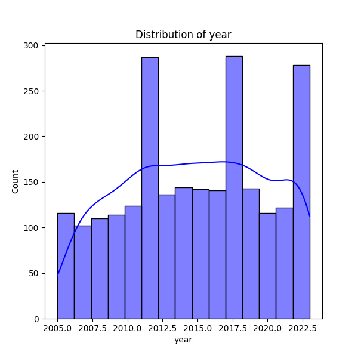
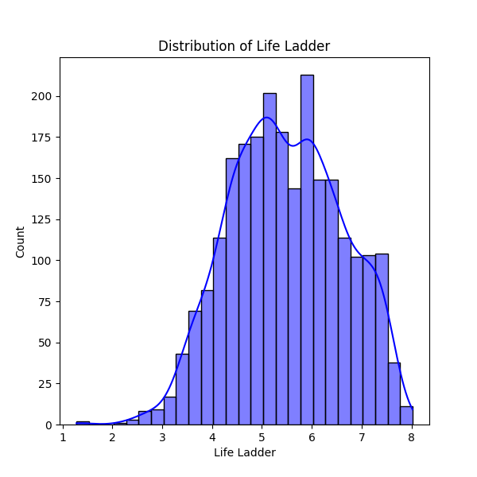
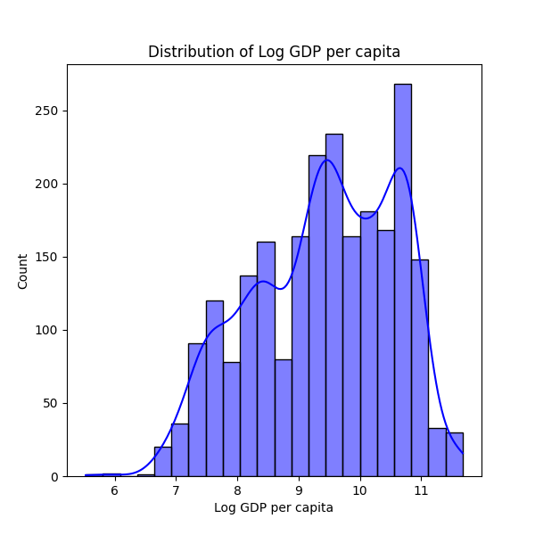
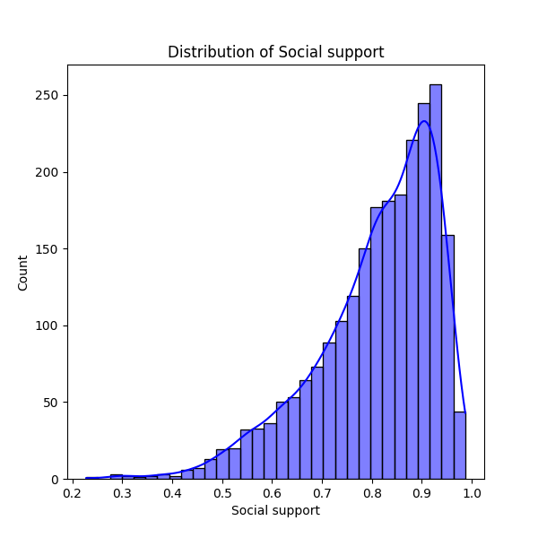

# Dataset Analysis Report: happiness.md

## Dataset Summary

**Shape:** (2363, 11)

**Columns:**

Country name, year, Life Ladder, Log GDP per capita, Social support, Healthy life expectancy at birth, Freedom to make life choices, Generosity, Perceptions of corruption, Positive affect, Negative affect

## Insights and Analysis

### Key Statistics

Total rows: 2363, Total columns: 11

### Descriptive Statistics:
       Country name         year  Life Ladder  Log GDP per capita  Social support  Healthy life expectancy at birth  Freedom to make life choices   Generosity  Perceptions of corruption  Positive affect  Negative affect
count          2363  2363.000000  2363.000000         2335.000000     2350.000000                       2300.000000                   2327.000000  2282.000000                2238.000000      2339.000000      2347.000000
unique          165          NaN          NaN                 NaN             NaN                               NaN                           NaN          NaN                        NaN              NaN              NaN
top       Argentina          NaN          NaN                 NaN             NaN                               NaN                           NaN          NaN                        NaN              NaN              NaN
freq             18          NaN          NaN                 NaN             NaN                               NaN                           NaN          NaN                        NaN              NaN              NaN
mean            NaN  2014.763860     5.483566            9.399671        0.809369                         63.401828                      0.750282     0.000098                   0.743971         0.651882         0.273151
std             NaN     5.059436     1.125522            1.152069        0.121212                          6.842644                      0.139357     0.161388                   0.184865         0.106240         0.087131
min             NaN  2005.000000     1.281000            5.527000        0.228000                          6.720000                      0.228000    -0.340000                   0.035000         0.179000         0.083000
25%             NaN  2011.000000     4.647000            8.506500        0.744000                         59.195000                      0.661000    -0.112000                   0.687000         0.572000         0.209000
50%             NaN  2015.000000     5.449000            9.503000        0.834500                         65.100000                      0.771000    -0.022000                   0.798500         0.663000         0.262000
75%             NaN  2019.000000     6.323500           10.392500        0.904000                         68.552500                      0.862000     0.093750                   0.867750         0.737000         0.326000
max             NaN  2023.000000     8.019000           11.676000        0.987000                         74.600000                      0.985000     0.700000                   0.983000         0.884000         0.705000

### Correlation Analysis:
                                      year  Life Ladder  Log GDP per capita  Social support  Healthy life expectancy at birth  Freedom to make life choices  Generosity  Perceptions of corruption  Positive affect  Negative affect
year                              1.000000     0.046846            0.080104       -0.043074                          0.168026                      0.232974    0.030864                  -0.082136         0.013052         0.207642
Life Ladder                       0.046846     1.000000            0.783556        0.722738                          0.714927                      0.538210    0.177398                  -0.430485         0.515283        -0.352412
Log GDP per capita                0.080104     0.783556            1.000000        0.685329                          0.819326                      0.364816   -0.000766                  -0.353893         0.230868        -0.260689
Social support                   -0.043074     0.722738            0.685329        1.000000                          0.597787                      0.404131    0.065240                  -0.221410         0.424524        -0.454878
Healthy life expectancy at birth  0.168026     0.714927            0.819326        0.597787                          1.000000                      0.375745    0.015168                  -0.303130         0.217982        -0.150330
Freedom to make life choices      0.232974     0.538210            0.364816        0.404131                          0.375745                      1.000000    0.321396                  -0.466023         0.578398        -0.278959
Generosity                        0.030864     0.177398           -0.000766        0.065240                          0.015168                      0.321396    1.000000                  -0.270004         0.300608        -0.071975
Perceptions of corruption        -0.082136    -0.430485           -0.353893       -0.221410                         -0.303130                     -0.466023   -0.270004                   1.000000        -0.274208         0.265555
Positive affect                   0.013052     0.515283            0.230868        0.424524                          0.217982                      0.578398    0.300608                  -0.274208         1.000000        -0.334451
Negative affect                   0.207642    -0.352412           -0.260689       -0.454878                         -0.150330                     -0.278959   -0.071975                   0.265555        -0.334451         1.000000

### Missing Values:
Log GDP per capita                   28
Social support                       13
Healthy life expectancy at birth     63
Freedom to make life choices         36
Generosity                           81
Perceptions of corruption           125
Positive affect                      24
Negative affect                      16

## Description of Analysis

Sure! Let’s break down the analysis of the dataset into simpler terms:

### Overview of the Dataset
The dataset contains information from **2,363 rows** (or entries) and **11 columns** (or different types of information). It appears to focus on measurements related to happiness, economic conditions, and social factors across **165 different countries**.

### Key Statistics
- **Country Name**: There are **165 unique countries** represented, with the country that appears most frequently being Argentina.
- **Year**: The dataset spans multiple years, mainly around **2005 to 2023**.

### Descriptive Statistics
Here's a look at some key numbers for the data:
- **Life Ladder**: This seems to measure people's overall well-being, rating it on a scale from around **1.28 (low)** to **8.02 (high)**. On average, the life ladder score is approximately **5.48**.
- **Log GDP per Capita**: This is a logarithmic measure of economic wealth. The average is about **9.40**, with values ranging from **5.53 (low)** to **11.68 (high)**.
- **Social Support**: On average, people report having significant social support, with a typical score of around **0.81** on a scale from **0 (none)** to **1 (maximum support)**.
- **Healthy Life Expectancy**: This refers to the average number of years a person is expected to live in good health, with an average around **63.4** years.
- **Freedom to Make Life Choices**: People generally feel they have some level of freedom, scoring around **0.75** on average.
- **Generosity**: This measures how generous people feel; the average value is negligible, indicating that this factor does not significantly contribute to well-being in this dataset.
- **Perceptions of Corruption**: On average, people perceive a moderate level of corruption, with a score of about **0.74**.
- **Positive and Negative Affect**: These two columns measure how often people feel positive or negative emotions, with averages around **0.65** for positive feelings and **0.27** for negative feelings.

### Correlation Analysis
Correlation helps us understand how two variables relate to each other:
- There is a **strong positive correlation** between:
  - Life Ladder and Log GDP per Capita (**0.78**): As GDP increases, so does perceived happiness.
  - Social Support and Life Ladder (**0.72**): More social support is linked to higher happiness.
  - Healthy Life Expectancy and Log GDP per Capita (**0.82**): Higher GDP is associated with longer healthy life expectations.

- There’s a **negative correlation** between:
  - Perceptions of Corruption and Life Ladder (**-0.43**): Higher perceived corruption is related to lower happiness.
  - Negative Affect and Life Ladder (**-0.35**): More negative feelings correspond with lower happiness.

Overall, higher GDP, better social support, and lower corruption perceptions are linked to higher happiness scores.

### Missing Values
Some data points are missing:
- For instance, **28 entries** lack GDP information, and **125** lack information on corruption perceptions. This can influence the analysis, as we might not have a complete picture for every country.

### Summary
In simple terms, this dataset provides insights into how different factors, like economic wealth, social support, and personal freedoms, relate to people's happiness across various countries. It shows that wealth and social connections significantly impact how happy people feel, while perceived corruption has the opposite effect. However, there are some missing values that might affect some of the conclusions we can draw.

## Visualizations and Descriptions

### year Distribution

The graph above shows the distribution of the 'year' column. It visualizes the frequency distribution of the values. Look for the central tendency, spread, and any possible skewness in the distribution. From the descriptive statistics, the mean of this column is 2014.76, and the standard deviation is 5.06.

### Life Ladder Distribution

The graph above shows the distribution of the 'Life Ladder' column. It visualizes the frequency distribution of the values. Look for the central tendency, spread, and any possible skewness in the distribution. From the descriptive statistics, the mean of this column is 5.48, and the standard deviation is 1.13.

### Log GDP per capita Distribution

The graph above shows the distribution of the 'Log GDP per capita' column. It visualizes the frequency distribution of the values. Look for the central tendency, spread, and any possible skewness in the distribution. From the descriptive statistics, the mean of this column is 9.40, and the standard deviation is 1.15.

### Social support Distribution

The graph above shows the distribution of the 'Social support' column. It visualizes the frequency distribution of the values. Look for the central tendency, spread, and any possible skewness in the distribution. From the descriptive statistics, the mean of this column is 0.81, and the standard deviation is 0.12.

