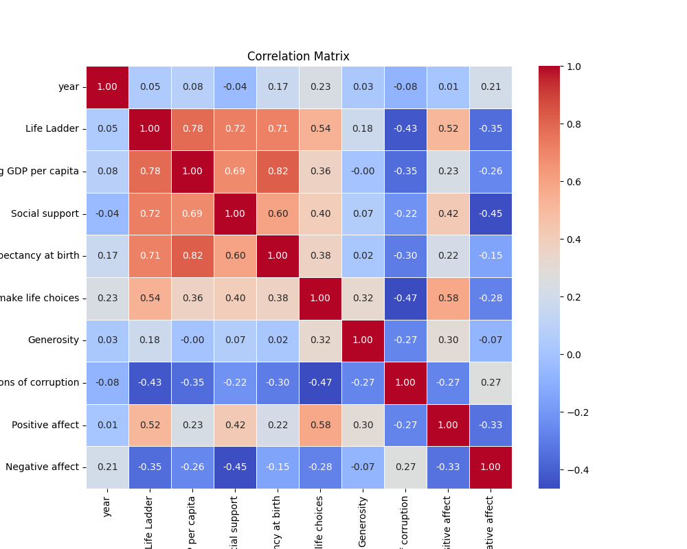
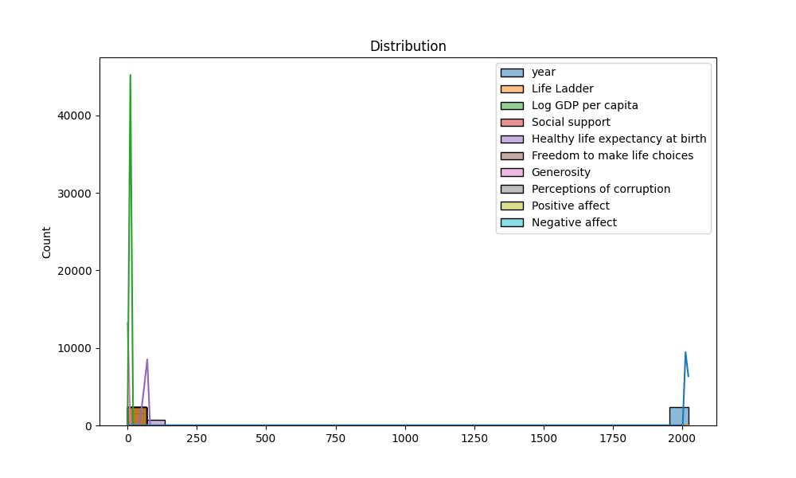

# Automated Data Analysis Report

## Introduction
This is an automated analysis of the dataset, providing summary statistics, visualizations, and insights from the data.

## Summary Statistics
The summary statistics of the dataset are as follows:

| Statistic | Column | Value |
|-----------|--------|-------|
| Mean       | year | 2014.76 |
| Std Dev    | year | 5.06 |
| Min        | year | 2005.00 |
| 25%        | year | 2011.00 |
| Median     | year | 2015.00 |
| 75%        | year | 2019.00 |
| Max        | year | 2023.00 |
| Mean       | Life Ladder | 5.48 |
| Std Dev    | Life Ladder | 1.13 |
| Min        | Life Ladder | 1.28 |
| 25%        | Life Ladder | 4.65 |
| Median     | Life Ladder | 5.45 |
| 75%        | Life Ladder | 6.32 |
| Max        | Life Ladder | 8.02 |
| Mean       | Log GDP per capita | 9.40 |
| Std Dev    | Log GDP per capita | 1.15 |
| Min        | Log GDP per capita | 5.53 |
| 25%        | Log GDP per capita | 8.51 |
| Median     | Log GDP per capita | 9.50 |
| 75%        | Log GDP per capita | 10.39 |
| Max        | Log GDP per capita | 11.68 |
| Mean       | Social support | 0.81 |
| Std Dev    | Social support | 0.12 |
| Min        | Social support | 0.23 |
| 25%        | Social support | 0.74 |
| Median     | Social support | 0.83 |
| 75%        | Social support | 0.90 |
| Max        | Social support | 0.99 |
| Mean       | Healthy life expectancy at birth | 63.40 |
| Std Dev    | Healthy life expectancy at birth | 6.84 |
| Min        | Healthy life expectancy at birth | 6.72 |
| 25%        | Healthy life expectancy at birth | 59.20 |
| Median     | Healthy life expectancy at birth | 65.10 |
| 75%        | Healthy life expectancy at birth | 68.55 |
| Max        | Healthy life expectancy at birth | 74.60 |
| Mean       | Freedom to make life choices | 0.75 |
| Std Dev    | Freedom to make life choices | 0.14 |
| Min        | Freedom to make life choices | 0.23 |
| 25%        | Freedom to make life choices | 0.66 |
| Median     | Freedom to make life choices | 0.77 |
| 75%        | Freedom to make life choices | 0.86 |
| Max        | Freedom to make life choices | 0.98 |
| Mean       | Generosity | 0.00 |
| Std Dev    | Generosity | 0.16 |
| Min        | Generosity | -0.34 |
| 25%        | Generosity | -0.11 |
| Median     | Generosity | -0.02 |
| 75%        | Generosity | 0.09 |
| Max        | Generosity | 0.70 |
| Mean       | Perceptions of corruption | 0.74 |
| Std Dev    | Perceptions of corruption | 0.18 |
| Min        | Perceptions of corruption | 0.04 |
| 25%        | Perceptions of corruption | 0.69 |
| Median     | Perceptions of corruption | 0.80 |
| 75%        | Perceptions of corruption | 0.87 |
| Max        | Perceptions of corruption | 0.98 |
| Mean       | Positive affect | 0.65 |
| Std Dev    | Positive affect | 0.11 |
| Min        | Positive affect | 0.18 |
| 25%        | Positive affect | 0.57 |
| Median     | Positive affect | 0.66 |
| 75%        | Positive affect | 0.74 |
| Max        | Positive affect | 0.88 |
| Mean       | Negative affect | 0.27 |
| Std Dev    | Negative affect | 0.09 |
| Min        | Negative affect | 0.08 |
| 25%        | Negative affect | 0.21 |
| Median     | Negative affect | 0.26 |
| 75%        | Negative affect | 0.33 |
| Max        | Negative affect | 0.70 |

## Missing Values
The following table shows the columns with missing values and their respective counts:

| Column | Missing Values Count |
|--------|----------------------|
| Country name | 0 |
| year | 0 |
| Life Ladder | 0 |
| Log GDP per capita | 28 |
| Social support | 13 |
| Healthy life expectancy at birth | 63 |
| Freedom to make life choices | 36 |
| Generosity | 81 |
| Perceptions of corruption | 125 |
| Positive affect | 24 |
| Negative affect | 16 |

## Outliers Detection
The table below summarizes the outliers detected using the IQR method:

| Column | Outlier Count |
|--------|---------------|
| year | 0 |
| Life Ladder | 2 |
| Log GDP per capita | 1 |
| Social support | 48 |
| Healthy life expectancy at birth | 20 |
| Freedom to make life choices | 16 |
| Generosity | 39 |
| Perceptions of corruption | 194 |
| Positive affect | 9 |
| Negative affect | 31 |

## Correlation Matrix
The correlation matrix below highlights the relationships between numerical features:

## Outliers Visualization
The chart below visualizes the number of outliers detected in each column:

## Distribution of Data
The following plot shows the distribution of the first numerical column in the dataset:

## Conclusion
This analysis provides a detailed overview of the dataset, including summary statistics, missing values, outlier detection, and correlation analysis.
The generated visualizations and statistical insights offer valuable understanding of the data's patterns and relationships.

## Data Story
This section can be customized to narrate key insights and findings derived from the data.
## Story
In a world increasingly defined by numbers, statistics, and data-driven decisions, understanding the intricate tapestry of human well-being is more crucial than ever. The dataset at hand offers a glimpse into the multifaceted nature of happiness across nations, capturing the essence of what it means to live a fulfilling life. By examining various indicators such as GDP, social support, perceptions of corruption, and emotional well-being, we embark on a journey to unravel the threads that weave together the fabric of global happiness.

As we delve into the data, we notice an overarching trend: the average 'Life Ladder' score, which serves as a proxy for subjective well-being, stands at approximately 5.48. This score, while seemingly average, masks a significant variation across different countries and years, highlighting the disparities in happiness levels worldwide. The correlation between 'Life Ladder' and 'Log GDP per capita' is particularly striking, with a robust correlation coefficient of 0.78. This suggests that as countries become wealthier, their citizens tend to report higher levels of life satisfaction. However, this correlation also invites skepticism; wealth alone does not guarantee happiness. For instance, countries with high GDP but low social support or high perceptions of corruption often see their citizens ranking lower on the happiness scale.

A closer look at the 'Social support' variable, which measures individuals' perceived ability to rely on friends and family in times of need, reveals its profound impact on well-being. With a correlation of 0.72 to the 'Life Ladder,' it becomes clear that community and connection are pivotal in fostering happiness. Countries that encourage strong social networks and support systems tend to report higher life satisfaction, demonstrating that wealth without strong interpersonal relationships may lead to hollow victories. Conversely, the correlation of -0.43 between 'Perceptions of corruption' and the 'Life Ladder' score underscores how distrust in governance can erode happiness. In nations where corruption is rampant, citizens often feel powerless, leading to a decline in overall life satisfaction.

Yet, the data does not simply tell a tale of correlation; it also illuminates the nuances of individual emotions. The dataset reveals a mean score of 0.65 for 'Positive affect,' indicating a general tendency towards happiness, contrasted by a negative affect score of 0.27. The interplay between these two dimensions of emotional well-being is critical; a high positive affect coupled with low negative affect signifies a state of contentment and emotional stability. For example, the data shows that while some countries boast high GDPs, their citizens may struggle with negative emotions, revealing a complex narrative of well-being that transcends mere financial metrics.

As we sift through the missing values and outliers in the dataset, we recognize the importance of inclusivity in data analysis. The gaps in social support, healthy life expectancy, and freedom to make life choices highlight areas where data collection can improve, ensuring that no voice goes unheard. Addressing these missing elements could provide a more holistic view of happiness, illuminating the factors that contribute to or detract from it.

In conclusion, this analysis of global happiness reveals a rich tapestry woven from various threads—economic prosperity, social connections, perceptions of corruption, and emotional well-being. The significant correlations between these variables prompt us to reflect on the implications for policymakers and community leaders alike. As we seek to enhance the well-being of our citizens, we must prioritize not just economic growth but also the cultivation of social bonds and trust within our societies. The lessons gleaned from this dataset remind us that happiness is not a destination but a journey, one that requires holistic understanding and concerted efforts to foster environments where individuals can thrive. By embracing this comprehensive approach, we can pave the way for a future where happiness is not merely quantified but genuinely experienced.
