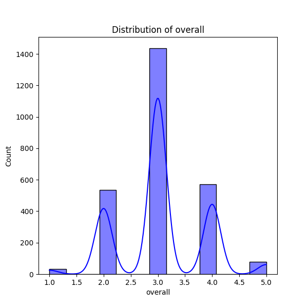
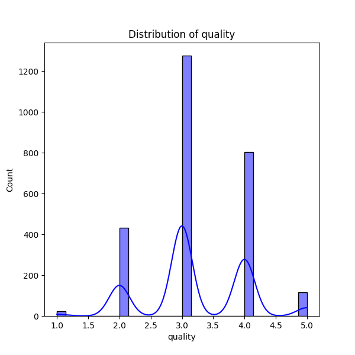
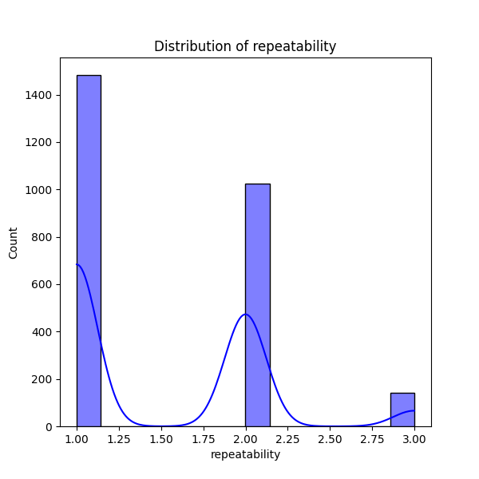

# Dataset Analysis Report: media.md

## Dataset Summary

**Shape:** (2652, 8)

**Columns:**

date, language, type, title, by, overall, quality, repeatability

## Insights and Analysis

### Key Statistics

Total rows: 2652, Total columns: 8

### Descriptive Statistics:
             date language   type              title                 by      overall      quality  repeatability
count        2553     2652   2652               2652               2390  2652.000000  2652.000000    2652.000000
unique       2055       11      8               2312               1528          NaN          NaN            NaN
top     21-May-06  English  movie  Kanda Naal Mudhal  Kiefer Sutherland          NaN          NaN            NaN
freq            8     1306   2211                  9                 48          NaN          NaN            NaN
mean          NaN      NaN    NaN                NaN                NaN     3.047511     3.209276       1.494721
std           NaN      NaN    NaN                NaN                NaN     0.762180     0.796743       0.598289
min           NaN      NaN    NaN                NaN                NaN     1.000000     1.000000       1.000000
25%           NaN      NaN    NaN                NaN                NaN     3.000000     3.000000       1.000000
50%           NaN      NaN    NaN                NaN                NaN     3.000000     3.000000       1.000000
75%           NaN      NaN    NaN                NaN                NaN     3.000000     4.000000       2.000000
max           NaN      NaN    NaN                NaN                NaN     5.000000     5.000000       3.000000

### Correlation Analysis:
                overall   quality  repeatability
overall        1.000000  0.825935       0.512600
quality        0.825935  1.000000       0.312127
repeatability  0.512600  0.312127       1.000000

### Missing Values:
date     99
by      262

## Description of Analysis

Here’s a breakdown of the dataset analysis in simpler terms:

### Overview of the Dataset
- The dataset contains **2,652 entries (rows)** and **8 different features (columns)**.
- Each entry appears to contain information about various items, likely movies or shows based on the context (like their titles and types).

### Descriptive Statistics
- Out of the total 2,652 entries, only **2,553 have a date recorded**. This means **99 entries are missing date information**.
- For the 'by' column (which seems to represent the creator or contributor), there are **262 missing values**. This means we don't know who created or contributed to these 262 entries.

#### Unique Features
- The date of the entries ranges over **2,055 unique days**, suggesting that the data spans a long period.
- There are **11 different languages** represented in the dataset.
- The 'type' column has **8 different categories**, with 'movie' being the most common.
  
#### Most Common Features
- The most frequently referenced **title** in the dataset is "Kanda Naal Mudhal," which appears **9 times**.
- The most common language is **English**, which is represented in **1,306 of the entries**.

### Average Ratings and Summary
- The overall score (likely a rating) of the entries averages **3.05** out of a possible 5, with a range from **1 to 5**.
- **Quality** ratings have an average of **3.21** and also range from **1 to 5**.
- **Repeatability** (which might refer to how often similar content appears) has an average of **1.49**.

### Distribution of Scores
- For overall ratings:
  - 25% of entries score **3 or lower**
  - 50% of entries score **3 or lower** (the median score)
  - 75% of entries score no more than **4**.
  
  This means that the majority of entries are fairly average in terms of overall and quality ratings.

### Correlation Analysis
- **Overall ratings and quality ratings are strongly correlated** (0.83), meaning when the overall rating is high, the quality rating is often high too.
- There's a moderate correlation between overall ratings and repeatability (0.51), suggesting that more popular items (higher overall ratings) are somewhat more likely to repeat in the dataset.
- The correlation between quality and repeatability is weaker (0.31).

### Summary of Missing Values
- The dataset has **99 missing values for the date** column and **262 missing values for the 'by' column**. This indicates some gaps in the data that might affect the analysis.

This analysis offers insights into the distribution of entries, their ratings, and how they relate to each other, while also highlighting areas where data is missing.

## Visualizations and Descriptions

### overall Distribution

The graph above shows the distribution of the 'overall' column. It visualizes the frequency distribution of the values. Look for the central tendency, spread, and any possible skewness in the distribution. From the descriptive statistics, the mean of this column is 3.05, and the standard deviation is 0.76.

### quality Distribution

The graph above shows the distribution of the 'quality' column. It visualizes the frequency distribution of the values. Look for the central tendency, spread, and any possible skewness in the distribution. From the descriptive statistics, the mean of this column is 3.21, and the standard deviation is 0.80.

### repeatability Distribution

The graph above shows the distribution of the 'repeatability' column. It visualizes the frequency distribution of the values. Look for the central tendency, spread, and any possible skewness in the distribution. From the descriptive statistics, the mean of this column is 1.49, and the standard deviation is 0.60.

