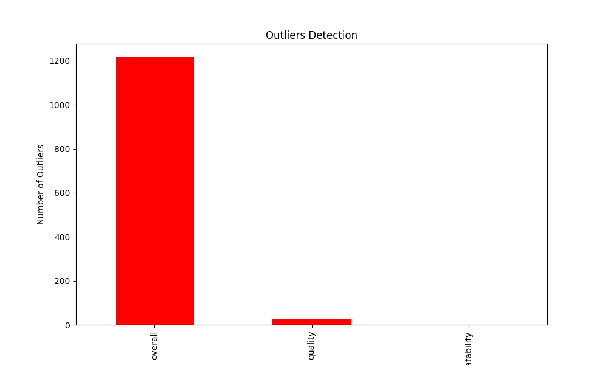
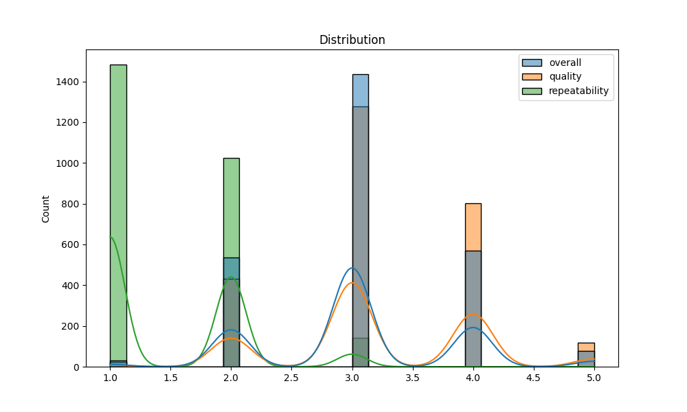

# Automated Data Analysis Report

## Introduction
This is an automated analysis of the dataset, providing summary statistics, visualizations, and insights from the data.

## Summary Statistics
The summary statistics of the dataset are as follows:

| Statistic | Column | Value |
|-----------|--------|-------|
| Mean       | overall | 3.05 |
| Std Dev    | overall | 0.76 |
| Min        | overall | 1.00 |
| 25%        | overall | 3.00 |
| Median     | overall | 3.00 |
| 75%        | overall | 3.00 |
| Max        | overall | 5.00 |
| Mean       | quality | 3.21 |
| Std Dev    | quality | 0.80 |
| Min        | quality | 1.00 |
| 25%        | quality | 3.00 |
| Median     | quality | 3.00 |
| 75%        | quality | 4.00 |
| Max        | quality | 5.00 |
| Mean       | repeatability | 1.49 |
| Std Dev    | repeatability | 0.60 |
| Min        | repeatability | 1.00 |
| 25%        | repeatability | 1.00 |
| Median     | repeatability | 1.00 |
| 75%        | repeatability | 2.00 |
| Max        | repeatability | 3.00 |

## Missing Values
The following table shows the columns with missing values and their respective counts:

| Column | Missing Values Count |
|--------|----------------------|
| date | 99 |
| language | 0 |
| type | 0 |
| title | 0 |
| by | 262 |
| overall | 0 |
| quality | 0 |
| repeatability | 0 |

## Outliers Detection
The table below summarizes the outliers detected using the IQR method:

| Column | Outlier Count |
|--------|---------------|
| overall | 1216 |
| quality | 24 |
| repeatability | 0 |

## Correlation Matrix
The correlation matrix below highlights the relationships between numerical features:

## Outliers Visualization
The chart below visualizes the number of outliers detected in each column:

## Distribution of Data
The following plot shows the distribution of the first numerical column in the dataset:

## Conclusion
This analysis provides a detailed overview of the dataset, including summary statistics, missing values, outlier detection, and correlation analysis.
The generated visualizations and statistical insights offer valuable understanding of the data's patterns and relationships.

## Data Story
This section can be customized to narrate key insights and findings derived from the data.
## Story
In the digital age, where choices abound and quality is often a moving target, a recent dataset has emerged, revealing fascinating insights into the world of user experiences. This dataset, comprising 2,652 entries, serves as a treasure trove for understanding how overall satisfaction, perceived quality, and repeatability of experiences interact and influence one another. As we delve into this analysis, we find ourselves on a journey through the intricacies of human evaluations, where numbers tell stories and trends illuminate paths toward improvement.

At first glance, the summary statistics paint a vivid picture of user sentiments. The overall satisfaction, on average, hovers at 3.05, with the quality slightly edging higher at 3.21, and repeatability lagging behind at 1.49. These figures suggest a landscape where experiences are met with a mix of contentment and apprehension. The standard deviations, particularly for quality (0.80), indicate significant variability in perceptions, hinting that while some users revel in excellence, others may feel shortchanged. Moreover, the minimum score of 1.0 starkly contrasts with the maximum of 5.0, underscoring the polarizing nature of experiences—some are stellar, while others are simply lackluster.

As we sift through the data, the missing values beckon attention. A notable 99 entries lack date information, which raises questions about timeliness and relevance—critical factors in user satisfaction. Furthermore, the absence of 262 contributor names adds another layer of anonymity, complicating our understanding of the feedback landscape. Still, these gaps do not overshadow the rich insights we can glean from the existing data. 

The correlation matrix is where the magic truly unfolds. The strong correlation (0.83) between overall satisfaction and quality suggests that users who perceive a higher quality in their experiences are also more likely to report greater overall satisfaction. This insight leads us to ponder: how can organizations enhance perceived quality to boost overall satisfaction? Meanwhile, the moderate correlation (0.51) between overall satisfaction and repeatability hints at a complex relationship—while satisfied users may return, the allure of quality must remain consistent to encourage repeat interactions. 

However, lurking within the dataset are outliers—1,216 instances of overall satisfaction that stand out from the crowd. These outliers represent experiences that deviate significantly from the norm, which could either be exceptional or abysmal. Identifying the stories behind these outliers could unlock powerful insights into what drives high satisfaction or, conversely, what leads to discontent. 

As we conclude our exploration of this dataset, it becomes clear that the interplay between overall satisfaction, quality, and repeatability is intricate and multifaceted. Organizations that seek to thrive in this environment must prioritize understanding their users’ experiences, focusing not only on enhancing quality but also on fostering an atmosphere where repeatability becomes a natural outcome of satisfaction. 

In essence, this analysis is more than just numbers; it is a call to action. By addressing the gaps in data, exploring the outliers, and leveraging the correlations, businesses can craft experiences that resonate deeply with users. As we navigate the complexities of consumer feedback, the insights gleaned from this dataset illuminate the path toward building lasting relationships and ensuring that every interaction is one worth repeating.
